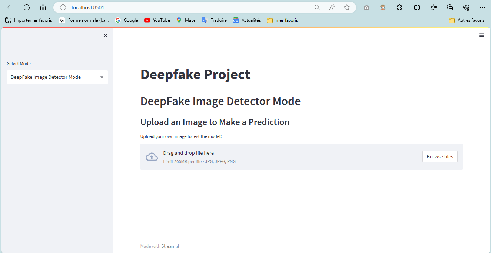

## Deepfake Generation and Detection App

### Project Overview

This Streamlit application is designed to both generate and detect deepfakes. It enables the creation of deepfakes in audio, image, and video formats, and features a detection system specifically for image-based deepfakes. The application utilizes advanced machine learning models to ensure high accuracy in both generation and detection tasks.

### Features

- **Deepfake Generation:** Users can create deepfakes in various media formats, enhancing their understanding of how deepfake technology works.
- **Deepfake Detection:** The app provides tools to detect image-based deepfakes, helping users identify manipulated content.
- **User-Friendly Interface:** Built with Streamlit, the app offers a clean and intuitive interface for easy navigation and operation.

### Technologies Used

- **Streamlit:** For creating a responsive web application.
- **Python:** The primary programming language used for both backend and integration of machine learning models.
- **Machine Learning Models:** Advanced models for accurate generation and detection of deepfakes.

### Goals

The main goal of this project is to educate and inform users about the capabilities and risks associated with deepfake technology, providing practical tools for generating and detecting deepfakes responsibly.

## Environment Setup

For uniformity, I suggest using **virtualenv** or **conda** with **pip** and **requirements.txt** to keep the tools used up to date.
With pip and virtualenv installed on your system, follow these steps:

1. Clone the repository with `git clone https://github.com/aminatouseyeup/Deepfakes.git`
2. In your project repo, create the virtual environment with `virtualenv venv` on Python version 3.7
3. Activate your virtual environment with `venv\Scripts\activate`
4. Run `pip install -r requirements.txt` to install all required packages.

## Download Pre-trained Models

At this point, it is important to download the pre-trained models from the links below:

### Deepfake Audio

1. Download the repo `https://github.com/misbah4064/Real-Time-Voice-Cloning.git` and include it in the folder `deepfake-audio-generator`
2. Download the file `pretrained.zip` from `https://drive.google.com/uc?id=1n1sPXvT34yXFLT47QZA6FIRGrwMeSsZc`
3. Copy `pretrained.zip` into the `Real-Time-Voice-Cloning` folder downloaded earlier and unzip it.

### Deepfake Image Swap

1. Download the file from `https://drive.google.com/file/d/1krOLgjW2tAPaqV-Bw4YALz0xT5zlb5HF/view`
2. Copy it into the `deepfake-image-swap` folder.

### Deepfake Video

1. Download the weights from `https://drive.google.com/uc?id=1zqa0la8FKchq62gRJMMvDGVhinf3nBEx&export=download`
2. Rename it to `model_weights.tar`
3. Copy it into the `deepfake-video-generator` folder.

## Launch the Project

Now you are ready to launch the application on Streamlit with the command `streamlit run main.py`.

## Preview

## Acknowledgments and References

This project utilizes several external repositories and resources that have significantly contributed to its development. Here is a list of these resources:

- `https://github.com/cdenq/deepfake-image-detector?tab=readme-ov-file`
- `https://github.com/sudouser2010/python-ninjas/blob/main/jupyter-notebooks/2023/deep_fake_video/deep_fake_video.ipynb`
- `https://github.com/misbah4064/Real-Time-Voice-Cloning.git`
